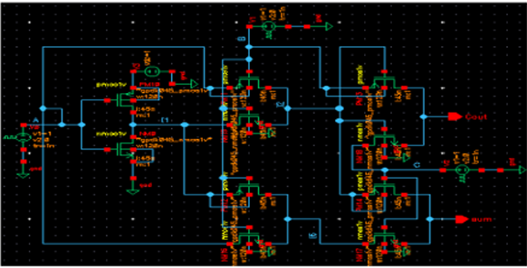
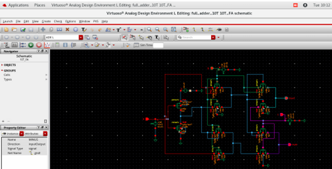
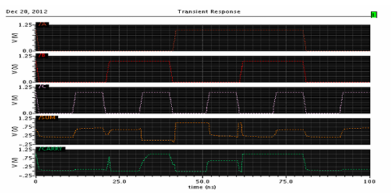
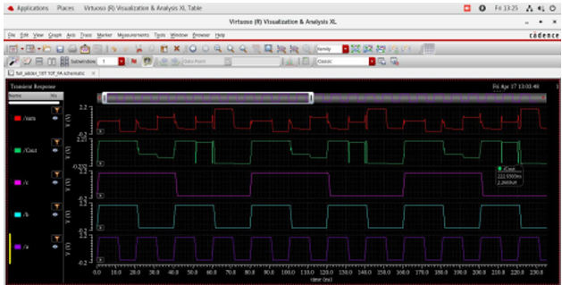

# Low-Power 10T Full Adder

## Project Overview

This project focuses on the design and power optimization of a 10-transistor (10T) full adder for low-power VLSI applications.

The circuit was implemented and analyzed using Cadence Virtuoso with a 45 nm CMOS process. Different circuit-level techniques were investigated to reduce power dissipation and leakage while maintaining the functionality of the full adder.

## Objectives

- Design and simulate a 10T full adder.
- Analyze power dissipation in deep-submicron CMOS technology.
- Investigate techniques for reducing leakage and overall power.
- Evaluate the effect of supply voltage, process variation, and transistor channel length on power consumption.

## Tools & Technologies

- Cadence Virtuoso
- ADE L
- 45 nm CMOS Technology
- CMOS
- Low-Power VLSI
- Transistor-Level Circuit Design
- Transient Simulation

## Circuit Design

The 10T full adder was implemented using CMOS inverter stages and evaluated through circuit-level simulations.

### Base Paper Circuit

### Implemented Circuit

## Simulation

Transient simulations were performed to verify the operation of the 10T full adder and analyze its electrical behavior.

### Base Design Waveform

### Implemented Design Waveform

## Power Optimization Techniques

The following techniques were investigated:

### 1. Supply Voltage Scaling

The supply voltage was reduced from **2 V to 1 V** to reduce power dissipation.

### 2. Process Variation Analysis

The model library was changed from **TT (Typical-Typical)** to **SF (Slow-Fast)** to study the effect of process variation.

### 3. Transistor Channel Length Optimization

The channel length of the MOSFETs was increased from **45 nm to 90 nm** to investigate its effect on leakage power.

### 4. Combined Optimization

The above three techniques were implemented together to obtain an optimized low-power configuration.

## Results

The base design achieved an average power of approximately:

**29.58 µW**

After applying the combined optimization techniques, the power was reduced to:

**7.099 µW**

This corresponds to approximately **76% reduction in power** compared with the base design.

### Base Power

### Optimized Power

## Conclusion

The project demonstrates the effectiveness of combining voltage scaling, process variation analysis, and transistor-level optimization for reducing power dissipation in a 10T full adder.

The optimized design achieved a significant reduction in power consumption, demonstrating the potential of these techniques for low-power VLSI circuit design.

## Project Report

[View the complete project report](report/10T_Full_Adder_Project_Report.pdf)
